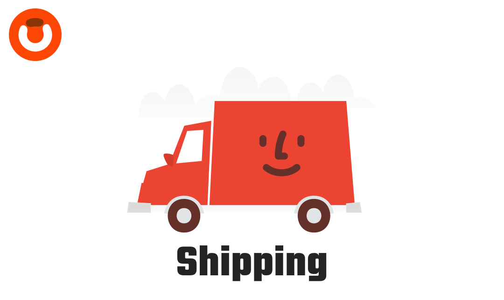

  
  

# Shipping Package

A comprehensive shipping module, enabling functionalities like carrier integration, rate calculation, label printing, and shipment tracking.

## Documentation

You can find the detailed documentation here in [Documentation](https://obelaw.com/docs/1.x/ecosystem/shipping.html).

## Contributing

Thank you for considering contributing to this package! Be one of the Obelaw team.

## License

This package is an open-sourced software licensed under the [MIT license](https://opensource.org/licenses/MIT).
